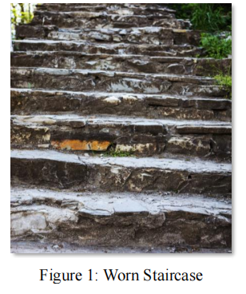

# Footprints Walked: A Dialogue Between the YOLO and the Stairs
## Summary

Carved stones are often used as building materials, symbolizing stability and eternity, and 
carrying the weight of history and cultural imprints. This paper establishes the FSM-YOLO 
wear identification model and the staircase information judgment model based on the 
YOLO algorithm by improving and training the YOLO model, aiming to help archaeologists 
infer key information such as the historical background, usage frequency, and construction time 
of buildings.

First, this paper collected a large number of actual staircase photos and preprocessed and 
augmented them for subsequent model training.

For Task 1, we improved the existing YOLOv8n model to establish the FSM-YOLO wear 
identification model. First, we added the FPN structure on the basis of YOLOv8n, enabling 
the model to better recognize the degree of step wear. Then, inspired by the multi-branch structure, we introduced the Squeeze-and-Excitation Attention (SA) mechanism to dynamically 
adjust the attention weights, thereby better identifying the features of the staircase wear area. 
Next, we introduced a distance-weighted mechanism to the Intersection over Union (IoU), defining the Mean Distance-Weighted IoU Loss (MDP-IOU) loss function, which enhanced 
the model's fine matching ability for staircase wear information. Finally, we annotated the collected images, using 80% as the training set and 20% as the test set to train the FSM-YOLO 
wear identification model. The model training and testing effects are shown in Figure 12, and 
we answered the three questions in Task 1 based on the identified features.

For Task 2, we established a staircase information judgment model based on the 
YOLO algorithm. First, according to Assumption 2, we collected the measurement data that 
we considered important. Then, we conducted a mechanism analysis of the step wear situation 
and combined it with a simulation of the wear coefficient to construct a staircase wear 
model. Next, we combined the staircase wear model with the FSM-YOLO wear identification 
model to obtain the staircase information judgment model based on the YOLO algorithm. 
After that, we annotated the collected image data, using 80% as the training set and 20% as the 
test set to train the model, and proposed using the C-14 dating method to determine the source 
of the staircase materials. Finally, we presented the model training and testing effects as shown 
in Figure 14, and answered the five questions in Task 2 based on the identified information.

Finally, this paper conducted a sensitivity and robustness analysis on the model and 
generalized it, verifying the model's stability and anti-interference capability, as well as its universality in multiple scenarios.

Keywords: YOLO algorithm; FSM-YOLO; SA mechanism; MDP-IOU; C-14 dating method

## Problem Background

Stone, known for its strength and durability, has been widely used in construction 
since ancient times, especially in historic 
temples and churches. Over time, however, 
stone is subject to wear due to prolonged use 
and environmental influences, with wear on 
staircases being particularly pronounced. The 
central areas of stair treads are often more 
worn than the edges, sometimes showing depressions or curvatures. These wear patterns 
not only record traces of human activity but 
also provide important clues for the historical 
evolution of architecture. The wear patterns 
on staircases reflect building usage frequency, 
movement directions, and behavioral patterns, 
thus holding significant research value.

However, extracting this information presents various challenges, such as the lack of historical records, the impact of material differences on wear analysis, and the obfuscation of original features due to renovation activities. Therefore, there is an urgent need to develop scientifically efficient analytical tools, using non-destructive and cost-effective mathematical models 
to interpret wear characteristics. This study aims to unveil the usage history of ancient buildings 
through such modeling frameworks and advance the scientific interpretation of human behavioral patterns, offering new perspectives and methodologies for archaeological research

## Restatement of the Problem

Given the background information and constraints provided in the problem statement, our 
task is to develop a mathematical model that can be generalized to various scenarios of worn 
stairs. The model should address the following objectives:
Task 1: Determine the usage patterns of stairs:
- Estimate the frequency of use over time. 
- Determine whether users tend to walk in a particular direction (e.g., going up or down). 
- Analyze whether people tend to walk in a single file or side by side. 
- Analyze whether the stairs are subject to high-intensity use over short periods of time or 
low-intensity use over long periods of time.
